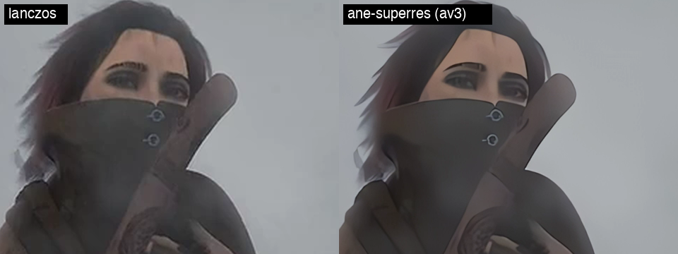
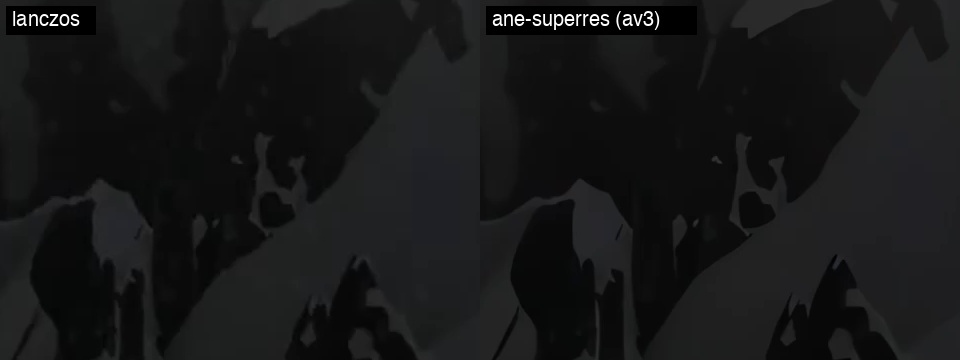
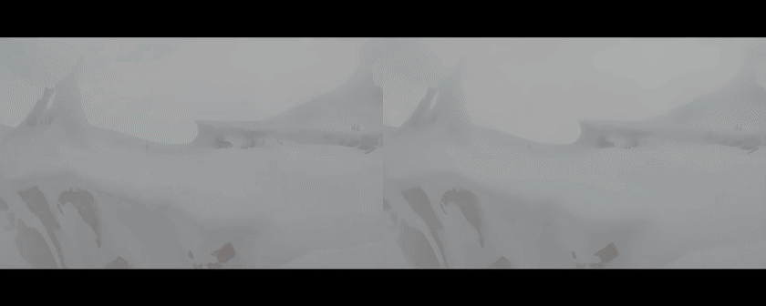

# ane-superres

Video super-resolution on Apple Silicon via **CoreML / Neural Engine** — no PyTorch
at runtime, no Vulkan, no ncnn.

One-command CLI that turns an SD video (e.g. PAL 720×576) into an upscaled,
deinterlaced, denoised H.264 file, running the SR model on the ANE at ~103 ms/frame
(MacBook Air M4, ×4 model) — roughly **32× faster** than the ncnn+Vulkan route on
the same machine.

| backend | ms/frame | full film (326k frames) |
|---|---:|---:|
| **ANE (this tool)** | **103** | ~9.3 h |
| GPU (CoreML/Metal) | 146 | ~13 h |
| CPU (CoreML) | 246 | ~22 h |
| ncnn + MoltenVK | 3300 | ~300 h |

720×576 → 2880×2304 (×4), model `realesr-animevideov3` (SRVGGNetCompact)
from [Real-ESRGAN](https://github.com/xinntao/Real-ESRGAN), converted to CoreML fp16.
Output is **bit-identical** to the ncnn/MoltenVK reference pipeline — same model
weights, same resampling chain.

## What it looks like

*Sintel* trailer (© Blender Foundation, CC-BY), degraded to 720×576 and upscaled
back to 1440×1152 — plain Lanczos (left) vs this tool (right). 1:1 crops, no
retouching.

| | |
|---|---|
|  |  |

Animated, half resolution — [full frames](compare/coat.png) in `compare/`:



## Install

```zsh
git clone <this repo> && cd ane-superres
./setup.sh
./sr-upscale VIDEO.mp4          # -> VIDEO_sr.mp4, 2× input size
```

macOS 14+ on Apple Silicon, `ffmpeg` and `python3.13` on PATH. coremltools has
native bindings only up to Python 3.13 — on 3.14 it fails with
`No module named 'coremltools.libcoremlpython'`; `setup.sh` pins the venv to 3.13.

## Usage

```zsh
./sr-upscale VIDEO                          # 2× input size, deint + denoise on
./sr-upscale VIDEO -o OUT.mp4 --target 1080x1440   # explicit output size (HxW!)
./sr-upscale VIDEO -s 1:35:05 -d 30         # fragment: start + duration
./sr-upscale VIDEO --no-deint               # progressive source
./sr-upscale VIDEO --bitrate 20M            # default 10M
./sr-upscale VIDEO --model models/x4plus.mlpackage
./sr-upscale VIDEO --chunk 600 --retries 20 # long, crash-resumable render
```

- `--target` is `HxW` (height first, matches e.g. VLC/HW scaling conventions in
  some tools — double-check before copy-pasting).
- Default target = 2× input (the ncnn `x2` semantics: ×4 model output, bicubic ½).
- Deinterlace (`bwdif=mode=send_field`) doubles the frame rate — PAL 25 → 50 fps
  output. The wrapper handles that automatically.
- Everything is streamed through pipes: no temp files, disk usage = output only.
- Audio is `-c:a copy`, never re-encoded.

## Long renders: `--chunk`

A 9-hour render will eventually meet a reboot, an OOM kill or a power cut.
With `--chunk SECONDS` the output is written as self-contained mp4 parts of
SECONDS each (keyframe forced at every boundary) into `OUT.parts/`. If the
render dies, **re-run the same command**: it skips every complete chunk on
disk, re-renders only the partial trailing one, and concatenates everything
into the final file at the end. `--retries N` does that loop automatically;
`--fresh` wipes the parts and starts over.

```zsh
./sr-upscale VIDEO --chunk 600 --retries 20   # chunks of 10 min, up to 20 restarts
```

Resume costs one partial chunk (SECONDS of output) — with 10-min chunks a
worst-case kill loses 10 minutes of work, not the whole film. Verified:
kill mid-chunk → re-run → final file frame-exact (duration and frame count
match a single-shot render, seam frames visually continuous).

### Full film, end to end (the commands we actually used)

```zsh
# 1. Keep the machine awake for the whole render — a CLI render does NOT hold
#    a power assertion, so macOS drifts into maintenance sleep every ~15 min
#    and the pipeline stalls. caffeinate in a separate terminal:
caffeinate -is -t 43200 &        # 12 h; 57600 for longer renders

# 2. The render itself (full PAL film, crash-resumable, batch-4 model):
./sr-upscale "Mechanik 1.mp4" \
  -o "Mechanik 1_sr.mp4" \
  --model models/av3x4_tensor_b4.mlpackage \
  --chunk 600 --retries 20

# 3. Quick quality check on a fragment before committing hours of render:
./sr-upscale "Mechanik 1.mp4" -s 01:35:05 -d 30 -o test_fragment.mp4
```

Real-world result: 720×576 PAL 25 fps → 1440×1080 @ 50 fps, 326 549 frames,
~10.5 h wall on a fanless MacBook Air M4 with the batch-4 ANE model
(116 ms/frame; a second film, 246 729 frames, took ~8.8 h at 128 ms/frame
the same way). The render survived a kill and resumed from the last
10-minute chunk.

## Pipeline

```
ffmpeg (bwdif + hqdn3d, rawvideo rgb24)
  → sr_driver.py (CoreML, ANE, ×4)
  → ffmpeg (bicubic ½ → centered crop → h264_videotoolbox, audio copy)
```

Details and the reasoning behind the resampling chain: [docs/pipeline.md](docs/pipeline.md).
Performance methodology and all measured numbers: [docs/benchmarks.md](docs/benchmarks.md).

## Other models

```zsh
./setup.sh --torch
./convert.py realesrgan-x4plus.pth models/x4plus.mlpackage 720x576
./sr-upscale VIDEO --model models/x4plus.mlpackage
```

Models are compiled with **fixed shapes** (a hard ANE requirement): one model file
= one input size. Different input size → reconvert with `convert.py`. Inputs and
outputs are float 0–1 NCHW tensors; the driver handles the 0–255 conversion.

`setup.sh --torch` also downloads the `realesr-animevideov3` `.pth` weights.

### Batching

ANE inference on a batch-1 model leaves the engine partly idle. `rebatch.py`
produces a copy of a model with batch N (the SRVGG graph is batch-agnostic):

```zsh
python3 rebatch.py models/av3x4_tensor.mlpackage 4 models/av3x4_tensor_b4.mlpackage
./sr-upscale VIDEO --model models/av3x4_tensor_b4.mlpackage
```

The driver reads the batch size from the model (pads the final partial batch by
repeating its last frame — output stays byte-identical). Batch-4 measured
~10% faster per frame than batch-1; the driver also overlaps postprocessing
with inference, which hides most of the remaining per-frame CPU cost.

## Why not ncnn?

ncnn+Vulkan *works* on macOS — after two fixes — but it is 32× slower on this
workload: MoltenVK compute-shader performance on Apple GPUs is poor, and the Mesa
KosmicKrisp driver is even worse (see [docs/benchmarks.md](docs/benchmarks.md)).
The two macOS-specific bugs and their patches (exec path, Vulkan portability
enumeration) are documented in [docs/ncnn-notes.md](docs/ncnn-notes.md) and
provided under `patches/ncnn/` if you need ncnn anyway.

## Traps we hit (so you don't have to)

- `realesrgan-ncnn-vulkan` release binaries segfault on macOS: `readlink("/proc/self/exe")`
  is Linux-only → `_NSGetExecutablePath` ([patch](patches/ncnn/0001-fix-macos-executable-path.patch)).
- ncnn never enables `VK_KHR_portability_enumeration` → MoltenVK is invisible
  (`vkCreateInstance failed -9`) → [patch](patches/ncnn/0002-enable-vk-khr-portability-enumeration.patch).
- coremltools does not support torch `upsample_bicubic2d` — do bicubic downscales
  in ffmpeg instead.
- A CoreML model converted with `ImageType` only accepts PIL images — for raw
  pipe workflows convert with `TensorType`.
- mlprogram models must be `.mlpackage`, not `.mlmodel`; the output tensor name
  is auto-generated (`var_312`), so read it from the model description, don't
  hardcode `output`.
- Model output is 0–1 float — forgetting `* 255` gives black frames.

## Credits & license

- Model weights: [Real-ESRGAN](https://github.com/xinntao/Real-ESRGAN) (BSD-3-Clause),
  `realesr-animevideov3` by Xintao Wang et al.
- Architecture `SRVGGNetCompact` from [BasicSR](https://github.com/XPixelGroup/BasicSR) (Apache-2.0).
- Conversion via [coremltools](https://github.com/apple/coremltools), inference via
  `coremltools` compute units (ANE/Metal/CPU).
- Sample comparison frames in `compare/` are from *Sintel* — © Blender Foundation,
  [CC-BY 3.0](https://durian.blender.org/).
- Code: MIT, see [LICENSE](LICENSE).